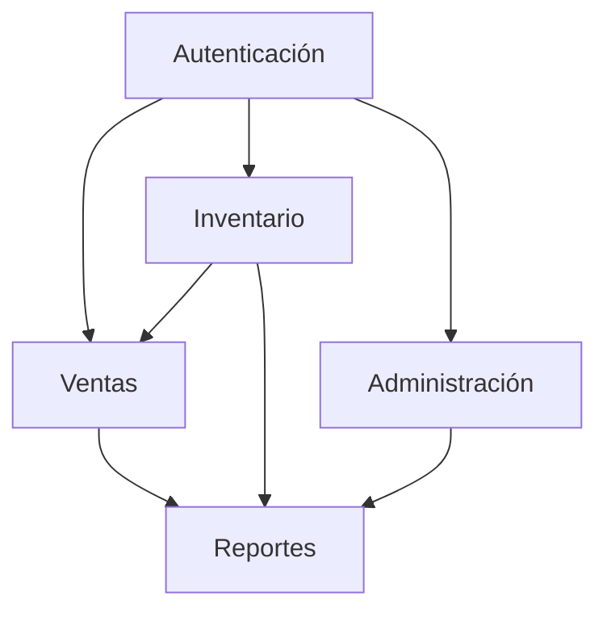

# Documentación de Módulos

## Índice
1. [Módulo de Autenticación](#módulo-de-autenticación)
2. [Módulo de Inventario](#módulo-de-inventario)
3. [Módulo de Ventas](#módulo-de-ventas)
4. [Módulo de Administración](#módulo-de-administración)
5. [Módulo de Reportes](#módulo-de-reportes)

## Módulo de Autenticación

### Descripción
El módulo de autenticación maneja todo lo relacionado con la seguridad y el acceso al sistema.

### Componentes Principales
- `LoginForm`: Formulario de inicio de sesión
- `ChangePasswordDialog`: Diálogo para cambio de contraseña
- `PrivateRoute`: Componente HOC para proteger rutas

### Funcionalidades
- Autenticación mediante JWT
- Gestión de sesiones
- Recuperación de contraseña
- Control de acceso basado en roles
- Bloqueo de cuenta por intentos fallidos

### Mejoras Propuestas
1. Implementar autenticación de dos factores
2. Añadir inicio de sesión con redes sociales
3. Mejorar la política de contraseñas
4. Implementar captcha para prevenir ataques

## Módulo de Inventario

### Descripción
Gestiona todos los aspectos relacionados con el control de productos y stock.

### Componentes Principales
- `Inventory`: Vista principal de inventario
- `ProductList`: Lista de productos
- `CategoryManager`: Gestión de categorías
- `MovementHistory`: Historial de movimientos

### Funcionalidades
- CRUD de productos
- Control de stock
- Gestión de categorías
- Registro de movimientos
- Alertas de stock bajo

### Mejoras Propuestas
1. Implementar sistema de códigos de barras/QR
2. Añadir gestión de lotes
3. Implementar sistema de ubicaciones
4. Añadir fotos de productos

## Módulo de Ventas

### Descripción
Maneja el proceso de ventas y facturación.

### Componentes Principales
- `Sales`: Vista principal de ventas
- `SaleDialog`: Formulario de venta
- `CustomerSelect`: Selector de clientes
- `PaymentForm`: Formulario de pago

### Funcionalidades
- Proceso de venta
- Gestión de clientes
- Facturación
- Múltiples métodos de pago
- Historial de ventas

### Mejoras Propuestas
1. Implementar sistema de descuentos
2. Añadir carrito de compras temporal
3. Implementar sistema de devoluciones
4. Añadir impresión de tickets

## Módulo de Administración

### Descripción
Proporciona herramientas para la configuración y administración del sistema.

### Componentes Principales
- `Admin`: Panel de administración
- `UserManager`: Gestión de usuarios
- `SecuritySettings`: Configuración de seguridad
- `SystemSettings`: Configuración del sistema

### Funcionalidades
- Gestión de usuarios y roles
- Configuración del sistema
- Auditoría y logs
- Respaldo y restauración

### Mejoras Propuestas
1. Implementar panel de monitoreo en tiempo real
2. Añadir más opciones de personalización
3. Mejorar el sistema de logs
4. Implementar notificaciones por correo

## Módulo de Reportes

### Descripción
Genera informes y estadísticas del sistema.

### Componentes Principales
- `Reports`: Vista principal de reportes
- `SalesReport`: Reporte de ventas
- `InventoryReport`: Reporte de inventario
- `Charts`: Componentes de gráficos

### Funcionalidades
- Reportes de ventas
- Estadísticas de inventario
- Gráficos y visualizaciones
- Exportación de datos

### Mejoras Propuestas
1. Añadir más tipos de reportes
2. Implementar reportes personalizados
3. Mejorar las visualizaciones
4. Añadir exportación a más formatos

## Integración entre Módulos

### Flujo de Datos

### Comunicación
- Uso de Context API para estado global
- Servicios centralizados
- Eventos y observables
- Cache compartido

## Consideraciones de Seguridad

1. **Autenticación**
   - Tokens JWT con renovación
   - Sesiones con tiempo límite
   - Validación en cada request

2. **Autorización**
   - Control de acceso por rol
   - Permisos granulares
   - Validación en frontend y backend

3. **Datos**
   - Encriptación de datos sensibles
   - Sanitización de inputs
   - Validación de datos

## Manejo de Errores

1. **Frontend**
   - Mensajes de error amigables
   - Retry automático
   - Fallbacks y estados de carga

2. **Logging**
   - Registro de errores
   - Monitoreo de performance
   - Alertas automáticas 